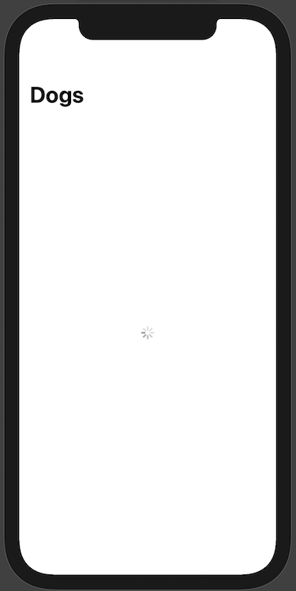
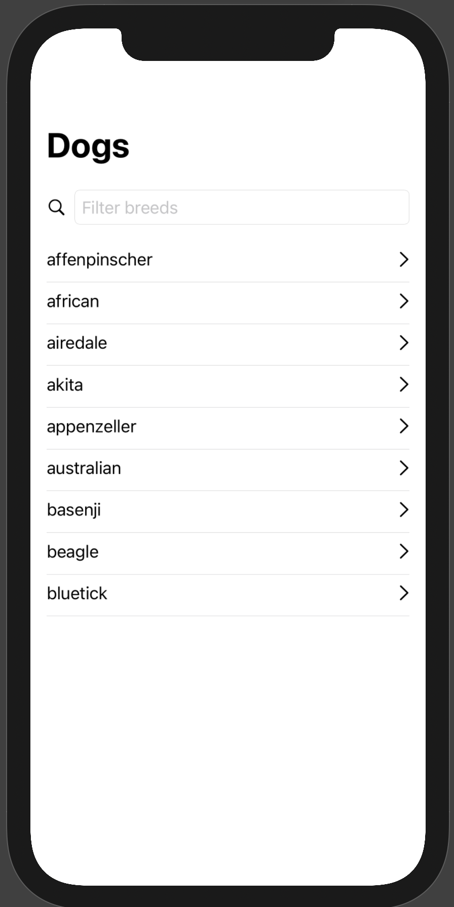
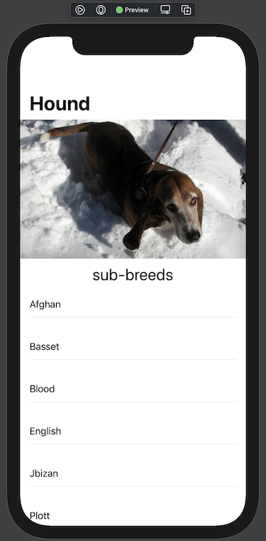

# Composable Architecture tutorial

> _Disclaimer_: This tutorial uses **Xcode 12.4**, **Swift 5.3**, and **iOS 14**.

> You can find the source code of this tutorial [here](https://github.com/Atimca/TCA-tutorial). If you're so eager to try it that you want to skip the tutorial, just launch `RootView.swift` preview.

## Introduction 

Today we are going to build a simple app, consisting of 2 screens, using `the composable architecture` (TCA for short). `TCA` is a variant of an [unidirectional architecture](https://medium.com/@atimca/how-to-cook-reactive-programming-part-1-unidirectional-architectures-introduction-5c73f3f7793d) built upon [reactive programming principles](https://medium.com/atimca/what-is-reactive-programming-43e60cc4c0f?source=friends_link&sk=4ab8aa82f6e669bad59be42cba67e0ef), created by PointFree. They provide extensive documentation about it and its creation process. You can check it out [here](https://www.pointfree.co/collections/composable-architecture). Interesting stuff and highly recommended if you like to understand every concept as intended by its creators.

The scope of this tutorial is to help onboard the TCA concepts as soon as possible. Which makes it a handy tutorial for people that need to work with these concepts right away. 

This is what we are aiming for: 


For this tutorial, we are going to use an open [Dogs API](https://dog.ceo/dog-api/documentation/
) which doesn't require a token and perfectly suits the needs of this article. Let's take a look at the app structure.

- **Main screen:** List of dog breeds with a possibility to filter by name.
- **Detailed screen:** A screen with a particular dog's breed as a title, random dog image + a list of dog's sub-breeds if available.

Both screens are going to be separate modules that don't know about each other, so you can see modularization techniques of `TCA` as well. However, let's start with a bit of theoretical knowledge so we know what we’re doing here.

## What is The Composable Architecture

`TCA` is one of the variations of [unidirectional architectures](https://medium.com/@atimca/how-to-cook-reactive-programming-part-1-unidirectional-architectures-introduction-5c73f3f7793d) family, such as `Redux`, `RxFeedback`, `Flux` etc. Let's just copy some explanation from the [official GitHub](https://github.com/pointfreeco/swift-composable-architecture).

This library provides a few core tools you can use to build applications of varying purposes and complexity. It provides compelling stories that you can follow to solve many day-to-day problems you encounter when building applications, such as:

* **State management**
 <br> How to manage the state of your application using simple value types, and share the state across many screens. This way, you can see mutations in one screen immediately in another.

* **Composition**
 <br> How to break down large features into smaller components that can be extracted to their own, isolated modules. And that you can easily glued back together to form the feature.

* **Side effects**
 <br> How to let certain parts of the application talk to the outside world in the most testable and understandable way possible.

* **Testing**
 <br> How to test a feature built in the architecture, but also write integration tests for features that have been composed of many parts. Also: how to write end-to-end tests to understand how side effects influence your application. This allows you to make strong guarantees that your business logic is running in the way you expect it to.

* **Ergonomics**
 <br> How to accomplish all of the above in a simple API with as few concepts and moving parts as possible.

To build a feature using the Composable Architecture, let's define some types and values that model a domain:

* **State**
 <br> A type that describes the data your feature needs to perform its logic and render its UI.

* **Action**
 <br> A type that represents all actions that can happen in your features, such as user actions, notifications, event sources et cetera.

* **Environment**
 <br> A type that holds any dependencies the feature needs, like API clients, analytics clients and so on.

* **Reducer**
 <br> A function that describes how to evolve the current state of the app to the next state given an action. The reducer is also responsible for returning any effects that should be run, such as API requests, which can be done by returning an Effect value.

* **Store**
 <br> The runtime that actually drives your feature. You send all user actions to the store so that the store can run the reducer and effects. You can also check state changes in the store so that you can update UI.

Now that the introduction is done, let's get to the action 🚀

## The Setup

Usually, every iOS tutorial starts with the project creation. But now, since it’s 2021 and all, you only need [SPM](https://swift.org/package-manager/) to build this small app. Let's do a little bit of [RW](https://www.raywenderlich.com) style.

In Xcode, select **File ▸ New ▸ Swift Package…**. Then set the **Product Name** to **DogBreedsComponent**.


Click **Create** et voilà. Easy peasy right?


### Adding necessary dependencies to the Project

Let's update the `Package.swift` file by adding necessary dependencies that we need for this tutorial. The final result will look like this:

```swift
// swift-tools-version:5.3
// The swift-tools-version declares the minimum version of Swift required to build this package.

import PackageDescription

let package = Package(
    name: "DogBreedsComponent",
    platforms: [.iOS(.v14)],
    products: [
        .library(
            name: "DogBreedsComponent",
            targets: ["DogBreedsComponent"]
        ),
    ],
    dependencies: [
        // 1.
        .package(
            name: "swift-composable-architecture",
            url: "https://github.com/pointfreeco/swift-composable-architecture.git",
            .exact("0.17.0")
        ),
        // 2.
        .package(
            name: "Kingfisher",
            url: "https://github.com/onevcat/Kingfisher",
            .exact("6.2.1")
        )
    ],
    targets: [
        .target(
            name: "DogBreedsComponent",
            dependencies: [
                .product(name: "ComposableArchitecture", package: "swift-composable-architecture"),
                .product(name: "Kingfisher", package: "Kingfisher")
            ]
        ),
        .testTarget(
            name: "DogBreedsComponentTests",
            dependencies: [
                "DogBreedsComponent",
                .product(name: "ComposableArchitecture", package: "swift-composable-architecture")
            ]
        ),
    ]
)

```

We've added 2 dependencies to the package:

1. `TCA` framework itself
2. `Kingfisher` library, that we’re going to use for async image loading

### Extras

For the implementation of this tutorial there are 2 simple extensions

#### `KFImage+Header.swift`

An extension that helps to build a proper layout with **KFImage**. That’s an **Image** type from the `Kingfisher` library, with a possibility to load async images:

```swift
import Kingfisher
import SwiftUI

extension KFImage {
    func header() -> some View {
        GeometryReader { geometry in
            resizable()
                .placeholder {
                    ProgressView()
                        .frame(height: 240)
                }
                .aspectRatio(contentMode: .fill)
                .frame(width: geometry.size.width, height: 240)
                .clipped()
        }
        .frame(height: 240)
    }
}
```

#### `String+Capitalized.swift`

An extension we're going to use for styling strings.

```swift
extension String {
    var capitalizedFirstLetter: String {
        prefix(1).capitalized + dropFirst()
    }
}
```
 
Please copy these 2 extensions into your project, to make sure your journey goes as smooth as butter. 🧈

## Dogs module

First, we're going to build the Dogs module. Basically the main and start module of this tutorial. With TCA it's usually possible to start with 2 directions: business or layout. You could even split this work between 2 people via splitting business-logic-based `State` from view/layout-based `ViewState`.

### Build the Dogs screen

In this tutorial, we’ll start with the layout for the main **Dogs** screen. Here's what we're going to build:

**Loading screen**, while loading dog breeds:  


**Loaded screen**, with loaded dog breeds and a filtering field:


Let's create a `DogsView` itself. The result is supposed to look like this:

```swift
import SwiftUI

struct DogsView: View {
    var body: some View {
        Text("Hello, World!")
    }
}

struct SwiftUIView_Previews: PreviewProvider {
    static var previews: some View {
        DogsView()
    }
}
```

Nothing fancy, just a `SwiftUI` view from a template. However, we're going to use `DogsView` as a namespace for a further journey.

### ViewState

Just a small reminder that unidirectional architectures are state-based with a data-driven model. In a data-driven approach, the life cycle will be triggered whenever a piece of data changes. As opposed to an event-driven model where a life cycle will be triggered whenever an event occurs. So, let's build this "model" `ViewState` for **Dogs** screen.

```swift
extension DogsView {
    // 1.
    struct ViewState: Equatable {
        // 2.
        let filterText: String
        // 3.
        let loadingState: LoadingState
    }
}

// MARK: - Loading
// 3.
extension DogsView.ViewState {
    enum LoadingState: Equatable {
        case loaded(breeds: [String])
        case loading
        
        var breeds: [String] {
            guard case .loaded(let breeds) = self else { return [] }
            return breeds
        }
        
        var isLoading: Bool { self == .loading }
    }
}
```

Here’s what happened: 

1. A `struct` **ViewState** which is going to represent **DogsView** layout.
2. A `filterText` property speaks for itself.
3. A `loadingState` state property which is a simple `enum` **LoadingState**. It's pretty important to have our **ViewState** consistent, so it's not possible to end up in a situation where the screen is loading and showing dogs at the same time (if that's not our intention, of course).

### ViewAction

**ViewAction** only represents events from the user or view life cycle. Let's build every needed action or event for **DogsView** as an enumeration:

```swift
extension DogsView {
    enum ViewAction: Equatable {
        case cellWasSelected(breed: String)
        case onAppear
        case filterTextChanged(String)
    }
}
```
For **DogsView.ViewAction** we basically listed every action the **DogsView** is interested in. You'll see how this is used soon.

### Layout

Now let's build a `SwiftUI` body for the **DogsView** as presented in the GIF earlier:

```swift
import ComposableArchitecture
import SwiftUI

struct DogsView: View {
    
    // 1.
    let store: Store<ViewState, ViewAction>
    
    var body: some View {
        // 2.
        WithViewStore(store) { viewStore in
            VStack {
                
                // 3.
                if viewStore.loadingState.isLoading {
                    ProgressView()
                } else {
                    searchBar(for: viewStore)
                    breedsList(for: viewStore)
                }
                
            }
            .navigationBarTitle("Dogs")
            .padding()
            // 4.
            .onAppear { viewStore.send(.onAppear) }
        }
    }
}
```

Here's what happened:

1. **DogsView** owns its own **Store** based on **ViewState** and **ViewAction**.
2. `SwiftUI` `TCA` based implementation uses `WithViewStore` that returns a **View** and has a closure with **ViewStore** type inside. **ViewStore** is basically just a wrapper that allows you to have direct access to **State** and ability to send **Action**s.
3. Conditional check whether the `ViewState.LoadingState` is `.loading`. If it is, we show a progress view, or else a search bar and a breeds list. What's hidden under `searchBar` and `breedsList` you'll see in a moment.
4. In this particular scenario, it's interesting to know when the view has appeared via sending `ViewAction.onAppear` to the **Store**. We’ll cover the handling of these events in a bit.

Now after the main layout was built, let's take a look at the guts of the `searchBar` function.

```swift
@ViewBuilder
private func searchBar(for viewStore: ViewStore<ViewState, ViewAction>) -> some View {
    HStack {
        Image(systemName: "magnifyingglass")
        TextField(
            "Filter breeds",
            // 1.
            text: viewStore.binding(
                get: \.filterText,
                send: ViewAction.filterTextChanged
            )
        )
        .textFieldStyle(RoundedBorderTextFieldStyle())
        .autocapitalization(.none)
        .disableAutocorrection(true)
    }
}
```

Here's only one thing that’s interesting. For the `SwiftUI`'s text field you need to use **Binding** (A type that can read and write a value at the same time). However, the nature of unidirectional architectures allows mutating (write) values only via **Reducer**. That's why TCA provides a helper function `binding` on the **ViewStore**, that reads data from **State** and as a function sends data to the **Store** via Reducer with the given action `ViewAction.filterTextChanged`.

In other words, this:

```swift
viewStore.binding(
    get: \.filterText,
    send: ViewAction.filterTextChanged
)
```

Is equivalent to:

```swift
Binding(
    get: { viewStore.filterText },
    set: { viewStore.send(.filterTextChanged($0)) }
)
```

Let’s have a look at `breedsList` function real quick:

``` swift
@ViewBuilder
private func breedsList(for viewStore: ViewStore<ViewState, ViewAction>) -> some View {
    ScrollView {
        // 1.
        ForEach(viewStore.loadingState.breeds, id: \.self) { breed in
            VStack {
                // 2.
                Button(action: { viewStore.send(.cellWasSelected(breed: breed)) }) {
                    HStack {
                        Text(breed)
                        Spacer()
                        Image(systemName: "chevron.right")
                    }
                }
                Divider()
            }
            .foregroundColor(.primary)
        }
    }
    .padding()
}
```

Here's what happened:

1. By using `ForEach` we're going through the `ViewState.breeds` array and drawing cells for every breed.
2. The cell itself is presented via **Button** and when pressing on we send a `ViewAction.cellWasSelected` action to the **Store**.

### Layout Testing

What’s so great about `SwiftUI`? The previews are (when they work at least 😅). `TCA`'s data driven approach offers super simple ways to test our layout. Here's an example for **DogsView**:

```swift
struct DogsView_Previews: PreviewProvider {
    static var previews: some View {
        NavigationView {
            DogsView(
                store: Store(
                    initialState: DogsView.ViewState(
                        filterText: "",
                        loadingState: .loaded(
                            breeds: [
                                "affenpinscher",
                                "african",
                                "airedale",
                                "akita",
                                "appenzeller",
                                "australian",
                                "basenji",
                                "beagle",
                                "bluetick"
                            ]
                        )
                    ),
                    reducer: .empty,
                    environment: ()
                )
            )
        }
        
        NavigationView {
            DogsView(
                store: Store(
                    initialState: DogsView.ViewState(
                        filterText: "",
                        loadingState: .loading
                    ),
                    reducer: .empty,
                    environment: ()
                )
            )
        }
    }
}
```

As you can see, by simply stubbing layout data, we can easily test 2 main scenarios (loading and loaded states) for this view. We're going to cover how to use a reducer and an environment in this scenario later on.

## Build Dogs business logic

After we've finished the layout, we’re going to add some business logic. I'm a fan of separating layout and business logic domains. So, let's build business logic for the Dogs module.

### State

Let's describe the data of Dogs module feature that needs to perform its logic:

```swift
struct DogsState: Equatable {
    var filterQuery: String
    var dogs: [Dog]
    
    static let initial = DogsState(filterQuery: "", dogs: [])
}

public struct Dog: Equatable {
    let breed: String
    let subBreeds: [String]
}
```

As you can see, **DogsState** is pretty similar to the **DogsView.ViewState** but not quite the same. This separation approach gives us a possibility to completely split the layout from business logic. By using this approach, it's also much easier to reuse the same **State** for several screens at the same time or for different layouts for iPhone and iPad.

### Action

Alright, it’s time to build an action type that represents all of the actions that can happen in the Dogs module:

```swift
public enum DogsAction: Equatable {
    case breedWasSelected(name: String)
    case dogsLoaded([Dog])
    case filterQueryChanged(String)
    case loadDogs
}
```

Because the Dogs module itself is in charge of loading dogs, **DogsAction** has actions related to loading.

### Environment

I already pointed out that we need to load dogs somehow. As you may remember, **Environment** is a type that holds all dependencies.

```swift
struct DogsEnvironment {
    var loadDogs: () -> Effect<[Dog], Never>
}
```

Here you can see **DogsEnvironment**, which holds `loadDogs` dependency. The return type of this dependency is an **Effect**. I can’t phrase it any better than the way it’s stated in the official documentation:

> The `Effect` type encapsulates a unit of work that can be run in the outside world, and can feed data back to the `Store`. It is the perfect place to do side effects, such as network requests, saving/loading from disk, creating timers, interacting with dependencies, and more. Effects are returned from reducers so that the `Store` can perform the effects after the reducer is done running. It is important to note that `Store` is not thread safe, and so all effects must receive values on the same thread, **and** if the store is being used to drive UI then it must receive values on the main thread. An effect simply wraps a `Publisher` (Combine framework) value and provides some convenience initializers for
constructing some common types of effects.  

### Reducer

Let's put everything together in the dogs reducer:

```swift
extension DogsState {
    // 1.
    static let reducer = Reducer<DogsState, DogsAction, DogsEnvironment> { state, action, environment in
        switch action {
        // 2.
        case .breedWasSelected:
            return .none
        // 3.
        case .dogsLoaded(let dogs):
            state.dogs = dogs
            return .none
        // 4.
        case .filterQueryChanged(let query):
            state.filterQuery = query
            return .none
        // 5.
        case .loadDogs:
            return environment
                .loadDogs()
                .map(DogsAction.dogsLoaded)
        }
    }
}
```

Here's what happened:

First of all, let's take a look at every return value in this switch. Side effects in `TCA` provided by `Effect` as mentioned earlier. `TCA` framework provides a helper for `Effect` as well - `.none` which basically means that none of the work is going to be performed. This `.none` helper is used for every switch case, but one, which we'll get to right now.

1. **Reducer** type in `TCA` is actually a wrapper structure over the function known as `Reducer` in unidirectional architectures. This type provides some helper functions that we'll cover soon. 
2. `DogsAction.breedWasSelected` is not handled at this moment, because we're going to extract navigation from the Dogs module itself.
3. `DogsAction.dogsLoaded` is an action used for **DogsState** to update with new dogs when they‘re loaded.
4. `DogsAction.filterQueryChanged` is an action that’s called when the user changes the filter query.
5. `DogsAction.loadDogs` is an action called for dogs request. There’s only one place for this reducer, which returns a side effect via effect. As you can see, we map returned data from environment and map it back into **DogsAction**. Which is basically a great example for a unidirectional approach. After the side effect performed `DogsAction.dogsLoaded`, action will be called.

## Finalize Dogs module

In the previous steps, we've managed to create layout and business logic setups. Now it's time to put everything together and make it work.

### ViewState conversion from State

First, we need to bring our business logic world into Dogs screen layout. We're going to use [converters](https://en.wikipedia.org/wiki/Adapter_pattern) for it.

```swift
extension DogsView.ViewState {
    // 1.
    static func convert(from state: DogsState) -> Self {
        .init(
            filterText: state.filterQuery,
            loadingState: loadingState(from: state)
        )
    }
    
    private static func loadingState(from state: DogsState) -> LoadingState {
        if state.dogs.isEmpty { return .loading }
        
        // 2.
        var breeds = state.dogs.map(\.breed.capitalizedFirstLetter)
        if !state.filterQuery.isEmpty {
            // 3.
            breeds = breeds.filter {
                $0.lowercased().contains(state.filterQuery.lowercased())
            }
        }
        
        return .loaded(breeds: breeds)
    }
}
```

Here's what happened:

1. A simple function which converts **DogsState** into **DogsView.ViewState**.
2. Here you see the necessity of having separate states for business and layout domains. We don't care about formatting in our business logic, but it's important for the visual part.
3. Filtering logic is also just part of state conversion. We don't perform any special logic for filtering.

This approach helps with testing a lot too, since it makes our views as dumb as possible. Every view just renders simple data and sends actions back.

Here are some tests that should prove it:.

```swift
class DogsViewStateConverterTest: XCTestCase {
    func testViewStateFilterTextGoesFromStateFilterQuery() {
        // Given
        let filterQuery = "filter"
        // When
        let viewState = DogsView.ViewState.convert(from: DogsState(filterQuery: filterQuery, dogs: []))
        // Then
        XCTAssertEqual(viewState.filterText, filterQuery)
    }
    
    func testViewStateLoadingStateIsLoadingIfStateDogsAndFilterQueryIsEmpty() {
        // When
        let viewState = DogsView.ViewState.convert(from: DogsState(filterQuery: "", dogs: []))
        // Then
        XCTAssertEqual(viewState.loadingState, .loading)
    }
    
    func testViewStateLoadingStateIsLoadedGoesFirstLetterCapitalizedStateDogsBreedWithEmptyFilterQuery() {
        // Given
        let dogs = [Dog(breed: "breed0", subBreeds: []), Dog(breed: "breed1", subBreeds: [])]
        // When
        let viewState = DogsView.ViewState.convert(from: DogsState(filterQuery: "", dogs: dogs))
        // Then
        XCTAssertEqual(viewState.loadingState, .loaded(breeds: ["Breed0", "Breed1"]))
    }
    
    func testViewStateLoadingStateIsLoadedGoesFirstLetterCapitalizedStateDogsBreedFilteredContainsByFilterQuery() {
        // Given
        let breed0 = "Abc0"
        let breed1 = "Abc1"
        let breed2 = "Def0"
        let breed3 = "Def1"
        let dogs = [breed0, breed1, breed2, breed3].map { Dog(breed: $0, subBreeds: []) }
        // When
        let viewState = DogsView.ViewState.convert(from: DogsState(filterQuery: "abc", dogs: dogs))
        // Then
        XCTAssertEqual(viewState.loadingState, .loaded(breeds: [breed0, breed1]))
        
    }
}
```

We're going to use this converter inside an extension of **DogsState** and we'll see how to use it later.

```swift
extension DogsState {
    var view: DogsView.ViewState {
        DogsView.ViewState.convert(from: self)
    }
}
```

### Action conversion from ViewState

Despite state conversions for actions, it's necessary to convert in the other direction. 

```swift
extension DogsAction {
    static func view(_ localAction: DogsView.ViewAction) -> Self {
        switch localAction {
        case .cellWasSelected(let breed):
            return .breedWasSelected(name: breed)
        case .onAppear:
            return .loadDogs
        case .filterTextChanged(let newValue):
            return .filterQueryChanged(newValue)
        }
    }
}
```

### Showtime

Before we'll show you the final result, we’re just going to add something small to the **DogsEnvironment**:

```swift
extension DogsEnvironment {
    static let fake = DogsEnvironment(
        loadDogs: {
            Effect(
                value: [
                    Dog(breed: "affenpinscher", subBreeds: []),
                    Dog(breed: "bulldog", subBreeds: ["boston", "english", "french"])
                ]
            )
            .delay(for: .seconds(2), scheduler: DispatchQueue.main)
            .eraseToEffect()
        }
    )
}
```

I really admire this way of treating dependencies, because with just a simple extension we’re able to test the whole logic without a real network call. If you'd like to learn more, there is a [series](https://www.pointfree.co/collections/dependencies) from pointfree. To mimic some real network call behavior, we’ve added a small delay to see a transition from `loading` to `loaded` states.

Let's add another **DogsView** preview and see what we’ve got:

```swift
NavigationView {
    DogsView(
        // 1.
        store: Store(
            initialState: DogsState.initial,
            reducer: DogsState.reducer,
            environment: DogsEnvironment.fake
        )
        // 2.
        .scope(
            state: \.view,
            action: DogsAction.view
        )
    )
}
```

Here's what happened:

1. The first time we've only been interested in the layout, but here we used a business logic **Store**.
2. Here is a [scope](https://github.com/pointfreeco/swift-composable-architecture/blob/4ea3dfed61f7e60859b888050233dac4243715e0/Sources/ComposableArchitecture/Store.swift#L163-L178) function to "scope" business domain into layout view one.

Let's take a look at the result:


And it works even without any real API on board! Pretty cool right?

## Dogs module testing

We've already had the whole working Dogs module. But what about testing? There’s no need to copy the official readme, so here's a [link](https://github.com/pointfreeco/swift-composable-architecture#testing) on it. In short, the whole `State`/`Action` based approach really helps with testing.

### TestStore

If you're already finished reading how [testing and debugging](https://github.com/pointfreeco/swift-composable-architecture#testing) works in `TCA`, you probably know what **TestStore** is. Let's implement it for Dogs module:

```swift
class DogsStoreTests: XCTestCase {
    func testStore(initialState: DogsState = .initial)
    -> TestStore<DogsState, DogsState, DogsAction, DogsAction, DogsEnvironment> {
        TestStore(
            initialState: initialState,
            reducer: DogsState.reducer,
            environment: .failing
        )
    }
}
```

Nothing fancy, just a helper function that takes the same values as a normal **Store** but provides some testing functionality for us. **TestStore** provides `send` and `receive` functions that mimic real app/user behavior. But wait a second... What's the `environment: .failing` here? 

```swift
extension DogsEnvironment {
    static let failing = DogsEnvironment(
        loadDogs: { .failing("DogsEnvironment.loadDogs") }
    )
}
```

Remember, how cool we've managed to create a `fake` implementation for **DogsEnvironment**? This is the same situation. But in this case we'd like to fail if anything that used `loadDogs` dependency was not expected. Remember what I’ve said in the beginning, that **Effect** is just a **Publisher** with helpers? This `Effect.failing` is one of them.

Let's build our first test for dogs loading logic:

```swift
extension DogsStoreTests {
    func testDogsLoad() {
        
        // 1.
        let store = testStore()
        let expectedDogs = [Dog(breed: "dog", subBreeds: [])]
        // 2.
        store.environment.loadDogs = {
            Effect(value: expectedDogs)
        }
        
        // 3.
        store.send(.loadDogs)
        // 4.
        store.receive(.dogsLoaded(expectedDogs)) {
        // 5.
            $0.dogs = expectedDogs
        }
    }
}
```

Here's what happened:

1. Just a `store: TestStore` property, which we’ll use for testing.
2. Mock of `loadDogs` dependency.
3. Sending an action `DogsAction.loadDogs` for a request of dogs loading.
4. Expecting to receive dogs response as `DogsAction.dogsLoaded`.
5. Here's an assertion that **DogsState** mutated as expected.

If you'd like to see how TCA helps with highlighting test fails, please comment on our 2-5 points of the listed code.

Here's another filtering behavior that would be nice to test.

```swift
extension DogsStoreTests {
    func testFilterQueryChanged() {
        
        let store = testStore()
        let query = "buhund"
        
        store.send(.filterQueryChanged(query)) {
            $0.filterQuery = query
        }
    }
}
```

Nothing complicated, just state mutation when an action is sent.

Basically, that's it for the Dogs module. Congratulations! We still have stuff to do though.

## Breeds module

The Breeds module is going to be similar with regards to architectural principles. That's why it’s a great opportunity to train your new skills.

Here are requirements for this screen:
- Use `Dogs.breed` as a title for screen.
- Download a random picture for breed, according to this [documentation](https://dog.ceo/dog-api/documentation/breed) and place it as a header.
- Create a list with cells and use `Dogs.subBreeds` as a title for each cell.

The final result would look like this:



After you finish or if just want to skip this exercise, check this proposed code:

<details close>
<summary>Breeds module is here</summary>
<br>

#### `BreedView.swift`

```swift
import ComposableArchitecture
import Kingfisher
import SwiftUI

struct BreedView: View {
    
    let store: Store<ViewState, ViewAction>
    
    var body: some View {
        WithViewStore(store) { viewStore in
            ScrollView {
                
                KFImage(viewStore.imageURL)
                    .header()
                    
                viewStore
                    .subtitle
                    .flatMap(Text.init)
                    .font(.title)
                
                ForEach(viewStore.subBreeds, id: \.self) { breed in
                    VStack {
                        HStack {
                            Text(breed)
                            Spacer()
                        }
                        Divider()
                    }
                    .foregroundColor(.primary)
                }
                .padding()
                
            }
            .navigationBarTitle(viewStore.title)
            .onAppear { viewStore.send(.onAppear) }
        }
    }
}

#if DEBUG
struct BreedView_Previews: PreviewProvider {
    static var previews: some View {
        NavigationView {
            BreedView(
                store: Store(
                    initialState: BreedView.ViewState(
                        title: "hound",
                        subtitle: "sub-breeds",
                        subBreeds: [
                            "afghan",
                            "basset",
                            "blood",
                            "english",
                            "ibizan",
                            "plott",
                            "walker"
                        ],
                        imageURL: URL(string: "https://images.dog.ceo/breeds/hound-basset/n02088238_9351.jpg")
                    ),
                    reducer: .empty,
                    environment: ()
                )
            )
        }
    }
}
#endif
```

#### `BreedView+ViewAction.swift`

```swift
extension BreedView {
    enum ViewAction: Equatable {
        case onAppear
    }
}
```

#### `BreedView+ViewState.swift`

```swift
import Foundation

extension BreedView {
    struct ViewState: Equatable {
        let title: String
        let subtitle: String?
        let subBreeds: [String]
        let imageURL: URL?
    }
}

// MARK: - Converter
extension BreedView.ViewState {
    static func convert(from state: BreedState) -> Self {
        .init(
            title: state.dog.breed.capitalizedFirstLetter,
            subtitle: state.dog.subBreeds.isEmpty ? nil : "Sub-breeds",
            subBreeds: state.dog.subBreeds.map(\.capitalizedFirstLetter),
            imageURL: state.imageURL
        )
    }
}
```

#### `BreedState.swift`

```swift
import Foundation

struct BreedState: Equatable {
    let dog: Dog
    var imageURL: URL?
}

// MARK: - Scope
extension BreedState {
    var view: BreedView.ViewState {
        BreedView.ViewState.convert(from: self)
    }
}
```

#### `BreedAction.swift`

```swift
import Foundation

public enum BreedAction: Equatable {
    case breedImageURLReceived(URL?)
    case getBreedImageURL
}

// MARK: - Scope
extension BreedAction {
    static func view(_ localAction: BreedView.ViewAction) -> Self {
        switch localAction {
        case .onAppear:
            return .getBreedImageURL
        }
    }
}
```

#### `BreedEnvironment.swift`

```swift
import ComposableArchitecture

struct BreedEnvironment {
    var loadDogImage: (_ breed: String) -> Effect<URL?, Never>
}

#if DEBUG
extension BreedEnvironment {
    static let failing = BreedEnvironment(
        loadDogImage: { _ in .failing("DogsEnvironment.loadDogImage") }
    )
}

extension BreedEnvironment {
    static let fake = BreedEnvironment(
        loadDogImage: { _ in
            Effect(value: URL(string: "https://images.dog.ceo/breeds/hound-blood/n02088466_9069.jpg"))
                .delay(for: .seconds(2), scheduler: DispatchQueue.main)
                .eraseToEffect()
        }
    )
}
#endif
```

#### `BreedState+Reducer.swift`

```swift
import ComposableArchitecture

extension BreedState {
    static let reducer = Reducer<BreedState, BreedAction, BreedEnvironment> { state, action, environment in
        switch action {
        case .breedImageURLReceived(let url):
            state.imageURL = url
            return .none
        case .getBreedImageURL:
            return environment
                .loadDogImage(state.dog.breed)
                .map(BreedAction.breedImageURLReceived)
        }
    }
}
```

#### `BreedViewStateConverterTests.swift`

```swift
@testable import DogBreedsComponent
import XCTest

class BreedViewStateConverterTest: XCTestCase {
    
    func testViewStateTitleGoesFromFirstLetterCapitalizedStatesDogsBreed() {
        // Given
        let dog = Dog(breed: "dog", subBreeds: [])
        // When
        let viewState = BreedView.ViewState.convert(from: BreedState(dog: dog, imageURL: nil))
        // Then
        XCTAssertEqual(viewState.title, "Dog")
    }
    
    func testViewStateSubTitleIsSubBreedsIfStatesSubBreedsArrayIsNotEmpty() {
        // Given
        let dog = Dog(breed: "", subBreeds: ["0"])
        // When
        let viewState = BreedView.ViewState.convert(from: BreedState(dog: dog, imageURL: nil))
        // Then
        XCTAssertEqual(viewState.subtitle, "Sub-breeds")
    }
    
    func testViewStateSubBreedsGoFromFirstLetterCapitalizedStatesSubBreeds() {
        // Given
        let dog = Dog(breed: "", subBreeds: ["abc", "def"])
        // When
        let viewState = BreedView.ViewState.convert(from: BreedState(dog: dog, imageURL: nil))
        // Then
        XCTAssertEqual(viewState.subBreeds, ["Abc", "Def"])
    }
    
    func testViewStateImageURLGoesFromStatesImageURL() {
        // Given
        let url = URL(string: "dog.com")
        // When
        let viewState = BreedView.ViewState.convert(from: BreedState(dog: Dog(breed: "", subBreeds: []), imageURL: url))
        // Then
        XCTAssertEqual(viewState.imageURL, url)
    }
}
```

#### `BreedStoreTests.swift`

```swift
@testable import DogBreedsComponent
import ComposableArchitecture
import XCTest

class BreedStoreTests: XCTestCase {
    func testStore(initialState: BreedState)
    -> TestStore<BreedState, BreedState, BreedAction, BreedAction, BreedEnvironment> {
        TestStore(
            initialState: initialState,
            reducer: BreedState.reducer,
            environment: .failing
        )
    }
}

// MARK: - Image Loading
extension BreedStoreTests {
    func testBreedImageLoad() {
        
        let breedName = "Breed"
        let initialState = BreedState(dog: Dog(breed: breedName, subBreeds: []), imageURL: nil)
        let store = testStore(initialState: initialState)
        
        let expectedURL = URL(string: "breed.com")
        
        store.environment.loadDogImage = {
            XCTAssertEqual($0, breedName)
            return Effect(value: expectedURL)
        }
        
        store.send(.getBreedImageURL)
        store.receive(.breedImageURLReceived(expectedURL)) {
            $0.imageURL = expectedURL
        }
    }
}
```
</details>

## App module

So far we've accomplished 2 modules: Dogs and Breeds. However, they are completely independent from each other. Also: there's no way to navigate from Dogs to Breeds. Let's try to solve it with modularization techniques in `TCA`. If you’d like to know more details, watch this [pointfree collection](https://www.pointfree.co/collections/composable-architecture/modularity) about modularity.

Navigation is still a topic under discussion and there's no clear approach for it yet. I’m going to show you my vision on tt. Well, one of my visions actually.
For the App module there is no need to create a separate **ViewState** and **State** because the App module is going to serve only as a mediator with navigation over Dogs and Breeds modules.

### AppState

First of all, it’s good to remember that `TCA` is a part of a state-based unidirectional architectures family. In these architectures, there is usually just **ONE** state for the whole application. However, `TCA` framework provides some helpers for state composition. In other words, we can create several independent modules with independent states, which connect inside a single bigger state.

Let's start with the heart of the module **AppState**:

```swift
public struct AppState: Equatable {
    // 1.
    var dogs: [Dog]
    // 2.
    var dogsInternal = DogsInternalState()
    // 3.
    var breedState: BreedState?
    
    public static let initial = AppState(dogs: [], breedState: nil)
}
```


Here's what happened:

1. In this example, a `dogs` property is a shared property within the whole application. For other scenarios, it could be a **User** property, which you'll need access to throughout the app.
2. **DogsInternalState** we're going to cover the next step. You could treat it as a Dog module state inside the **AppState**. It's not optional, because the Dogs module basically exists within the whole app life cycle.
3. **BreedState?** is an optional state for the Breeds module. This state is optional because we use it for our detailed screen aka Breeds module.

But what's this **DogsInternalState** thing? Let's take a look:

```swift
// 1.
struct DogsInternalState: Equatable {
    var filterQuery: String

    init() {
        self.filterQuery = ""
    }

    init(state: DogsState) {
        self.filterQuery = state.filterQuery
    }
}

// 2.
extension DogsState {
    init(
        internalState: DogsInternalState,
        dogs: [Dog]
    ) {

        self.init(
            filterQuery: internalState.filterQuery,
            dogs: dogs
        )
    }
}

// 3.
extension AppState {
    var dogsState: DogsState {
        get {
            DogsState(internalState: dogsInternal, dogs: dogs)
        }
        set {
            dogsInternal = .init(state: newValue)
            dogs = newValue.dogs
        }
    }
}
```

Here's what happened:

1. You may  remember **DogsState** contains 2 properties: `filterQuery` and `dogs`. However, `dogs` is shared within the whole application. So, **DogsInternalState** is a helper entity, which consists of every property inside **DogsState** that are not shared with an upper module **AppState**. **DogsInternalState** has 2 initializers: one as an initial for **AppState** and a second one as a helper for initialization from **DogsState**.
2. This extension is just a convenience initializer from **DogsInternalState**, which contains any not shared property and the shared property itself.
3. A computed property `dogsState` which actually is a **DogsState** part of **AppState**.

### AppAction

```swift
public enum AppAction: Equatable {
    case breed(BreedAction)
    case breedsDisappeared
    case dogs(DogsAction)
}
```

**AppAction** as **AppState** is a composition of **BreedAction** and **DogsAction**. However, there's one extra action **AppAction.breedsDisappeared** which speaks for itself.

### AppReducer

Let's now try to build a reducer for App module:

```swift
extension AppState {
    static let reducerCore = Reducer<AppState, AppAction, Void> { state, action, _ in
        switch action {
        // 1.
        case .breed:
            return .none
        // 2.
        case .breedsDisappeared:
            state.breedState = nil
            return .none
        // 3.
        case .dogs(.breedWasSelected(let breed)):
            guard let dog = state.dogs.first(where: { $0.breed.lowercased() == breed.lowercased() }) else { fatalError() }
            state.breedState = BreedState(dog: dog, imageURL: nil)
            return .none
        // 4.
        case .dogs:
            return .none
        }
    }
}
```

Here's what happened:

1. Breed module actions inside **AppReducer**,  in which we have no interest whatsoever.
2. `AppAction.breedsDisappeared` an action where we need to clear **BreedState** after a screen disappeared.
3. `DogsAction.breedWasSelected` was abandoned inside **DogsReducer**. Now it's time to handle this action. We simply create a new **BreedState** that serves as a state for the Breed module. We'll show you how this state change will reflect navigation in the next steps.
4. Because we are interested in just one action from the Dogs module, all other actions can be safely ignored.

But wait! If the **AppReducer** ignores almost every action from Dogs and Breed modules, how ‘s this thing supposed to work at all? 🤔 The answer is simple. We've mentioned that **Reducer** is basically a wrapper over a reducer function + some handy helpers, right?

Before the big reveal, let's implement prod or live versions for our environments.

```swift
extension DogsEnvironment {
    
    private struct DogsResponse: Codable {
        let message: [String: [String]]
    }
    
    static let live = DogsEnvironment(
        loadDogs: {
            URLSession
                .shared
                .dataTaskPublisher(for: URL(string: "https://dog.ceo/api/breeds/list/all")!)
                .map(\.data)
                .decode(type: DogsResponse.self, decoder: JSONDecoder())
                .map { response in
                    response
                        .message
                        .map(Dog.init)
                        .sorted { $0.breed < $1.breed }
                }
                .replaceError(with: [])
                .receive(on: DispatchQueue.main)
                .eraseToEffect()
        }
    )
}
```

```swift
extension BreedEnvironment {
    
    private struct BreedImageResponse: Codable {
        let message: String?
    }
    
    static let live = BreedEnvironment(
        loadDogImage: { breed in
            URLSession
                .shared
                .dataTaskPublisher(for: URL(string: "https://dog.ceo/api/breed/\(breed)/images/random")!)
                .map(\.data)
                .decode(type: BreedImageResponse.self, decoder: JSONDecoder())
                .compactMap(\.message)
                .map(URL.init(string:))
                .replaceError(with: nil)
                .receive(on: DispatchQueue.main)
                .eraseToEffect()
        }
    )
}
```

Nothing really interesting here, just simple backing **URLSession** calls into needed dependencies. But have you already noticed we have 3 different implementations (failing, fake, and live) of environments without using protocols and such?

Now let's go back to the reducers:

```swift
public extension AppState {
    static let reducer = Reducer<AppState, AppAction, Void>
        // 1.
        .combine(
            // 2.
            AppState.reducerCore,
            // 3.
            DogsState
                .reducer
                // 4.
                .pullback(
                    // 5.
                    state: \.dogsState,
                    // 6.
                    action: /AppAction.dogs,
                    // 7.
                    environment: { _ in DogsEnvironment.live }
                ),
            // 8.
            BreedState
                .reducer
                // 9.
                .optional()
                .pullback(
                    state: \.breedState,
                    action: /AppAction.breed,
                    environment: { _ in BreedEnvironment.live }
                )
        )
}
```

Here's what happened:

1. Combining method helps to "combine" different reducers into one big reducer. So this combined reducer is going to work with every performed action from App, Dogs, and Breed modules as we'd like it to work.
2. As the first reducer here we use an **AppReducer** itself.
3. **DogsReducer** that we combined with a big **AppReducer** .That’s possible thanks to the **AppState** and **AppAction** structure.
4. **DogsReducer** is pulled back into **AppReducer** with the `pullback` function help. And as a result of this function we have **AppReducer**.
5. Via the usage of Swift **KeyPath**, we can say that **DogsReducer** is only going to work with the `dogsState` part of the **AppState**.
6. Via the usage of pointfree **CasePath** (if you'd like to know more, check out this [repository](https://github.com/pointfreeco/swift-case-paths). In short, it's a way to use enums in the same fashion as KeyPaths). We can say that **DogsReducer** is only going to work with the `AppAction.dogs` part of **AppAction**.
7. Here, we've just created a **DogsEnvironment**. If our app is more complicated and has a lot of dependencies, we'd use a closure parameter **AppEnviroment**. But in this case it's just a **Void**, so we don't need it.
8. **BreedReducer** that’s also combined into the big **AppReducer**
9. **BreedState** is optional inside **AppState**, so we use another **Reducer** helper `optional`.

### RootView

Basically, we've built the whole necessary logic, but haven't made a real navigation yet. The final **RootView** of the app:

```swift
public struct RootView: View {
    
    let store: Store<AppState, AppAction>
    let dogsView: DogsView

    public init(store: Store<AppState, AppAction>) {
        self.store = store
        // 1.
        dogsView = DogsView(
            store: store.scope(
                state: \.dogsState.view,
                action: { local -> AppAction in
                    AppAction.dogs(
                        DogsAction.view(local)
                    )
                }
            )
        )
    }
    
    public var body: some View {
        // 2.
        WithViewStore(store.scope(state: \.breedState)) { viewStore in
            HStack {
                // 3.
                dogsView
                NavigationLink(
                    destination: breedView,
                    isActive: viewStore.binding(
                        get: { $0 != nil },
                        send: .breedsDisappeared
                    ),
                    label: EmptyView.init
                )
            }
        }
    }
    
    // 4.
    var breedView: some View {
        IfLetStore(
            store.scope(
                state: \.breedState?.view,
                action: { local -> AppAction in
                    AppAction.breed(
                        BreedAction.view(local)
                    )
                }
            ),
            then: BreedView.init(store:)
        )
    }
}
```

Here's what happened:

1. **DogsView** was created as an immutable variable because it exists in the whole app life cycle and basically the main view of the app.
2. In the **RootView** we're just interested in the `breedState` part of the **AppState** only for navigation purposes, which means that closure will be called only on `breedState` changes.
3. The `body` of the view contains **DogsView** and invisible **NavigationLink** which is backed by **ViewStore** **Binding** with a destination of **BreedView**.
4. A property for **BreedView** creation. If you take a look inside, you’ll see the **IfLetStore** entity, which helps to create views, backed by store, only when it's possible.

That's basically it. For the last step, let's put everything together inside the **RootView** preview.

```swift
struct RootView_Previews: PreviewProvider {
    static var previews: some View {
        NavigationView {
            RootView(
                store: Store(
                    initialState: .initial,
                    reducer: AppState.combinedReducer,
                    environment: ()
                )
            )
        }
    }
}
```

You should see a working app with a real live API.


### App tests

Last but not least. Here’s the one test for App module:

<details close>
<summary>AppStoreTests.swift</summary>
<br>

```swift
@testable import DogBreedsComponent
import ComposableArchitecture
import XCTest

class AppStoreTests: XCTestCase {
    func testStore(initialState: AppState)
    -> TestStore<AppState, AppState, AppAction, AppAction, Void> {
        TestStore(
            initialState: initialState,
            reducer: AppState.reducer,
            environment: ()
        )
    }
}

// MARK: - Navigation
extension AppStoreTests {
    func testNavigation() {
        
        let breedName = "Hound"
        let dog = Dog(breed: breedName, subBreeds: ["subreed1", "subbreed2"])
        
        let initialState = AppState(
            dogs: [Dog(breed: "anotherDog0", subBreeds: []), dog, Dog(breed: "anotherDog1", subBreeds: [])]
        )
        let store = testStore(initialState: initialState)
        
        store.send(.dogs(.breedWasSelected(name: breedName))) {
            $0.breedState = BreedState(dog: dog, imageURL: nil)
        }
        
        store.send(.breedsDisappeared) {
            $0.breedState = nil
        }
    }
}
```
</details>

That's all folks! You've just built you're first TCA based application. Congratulations! 🥳 

## Where to go next

- [The framework itself](https://github.com/pointfreeco/swift-composable-architecture)
- [PointFree TCA video collection](https://www.pointfree.co/collections/composable-architecture)
- [Series of articles about reactive programming and unidirectional architectures](https://medium.com/atimca/what-is-reactive-programming-43e60cc4c0f?source=friends_link&sk=4ab8aa82f6e669bad59be42cba67e0ef) Learn more about the paradigm behind it and how to  build your own unidirectional architecture framework.
- [A video of another unidirectional architecture RxFeedback](https://academy.realm.io/posts/try-swift-nyc-2017-krunoslav-zaher-modern-rxswift-architectures/) A solid introduction to the concepts.
- [redux.js.org](https://redux.js.org) Thorough documentation about `Redux` framework for js. Don't need to go into the details, but this website contains a good explanation of the concept.